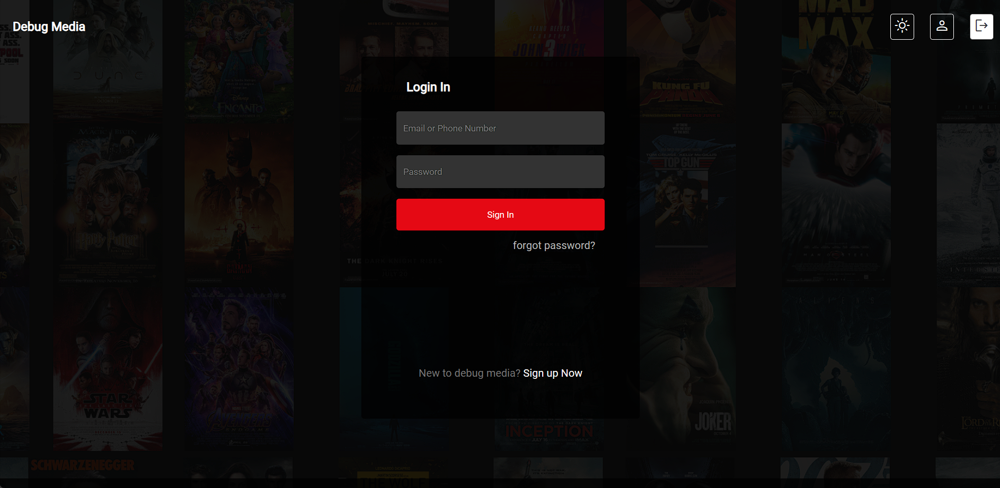
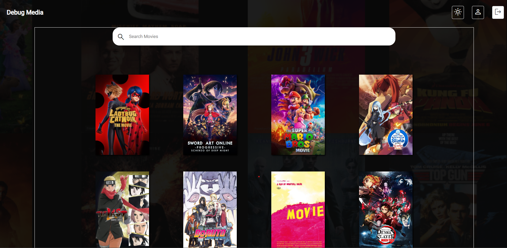

# MoviesClone App

This is a Movie Search Application using TMDB Movie API. User is authenticated using email and password(test for both). If user is authenticated redirected to homepage, else validation messages are displayed

## Features

- User Authentication
- Validation Messages
- Light/Dark Mode Switching
- LOGOUT button
- Movie Search

## Technologies Used

- React Router DOM
- Context API (Authentication, Theme and Error Handling)
- Local Storage
- Custom Hooks(Debounce & Local Storage)
- Protected Route using Outlet
- CSS
- Axios
- Vite

## Live Demo

[Demo](https://movie-search-app-two-steel.vercel.app/login)
(Username:test
Password:test
)

## CodeSandBox :

[https://codesandbox.io/p/github/lijoxavier/movie-search-app/main?workspaceId=6f3b0c47-a8b0-4297-ad30-0ac4b7d050f6]

## Login

<!--  -->

## Home

